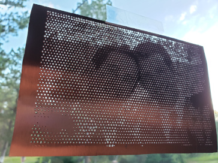

# image-gcode-stabber
Generates gcode (for a CNC machine) from an image to create patterns in materials.  Lighter pixels become larger holes, and darker pixels are smaller holes.  When the material is held up to a light source the image will be visible.

Some adjustments will likely be required, depending on the image and the CNC machine.

